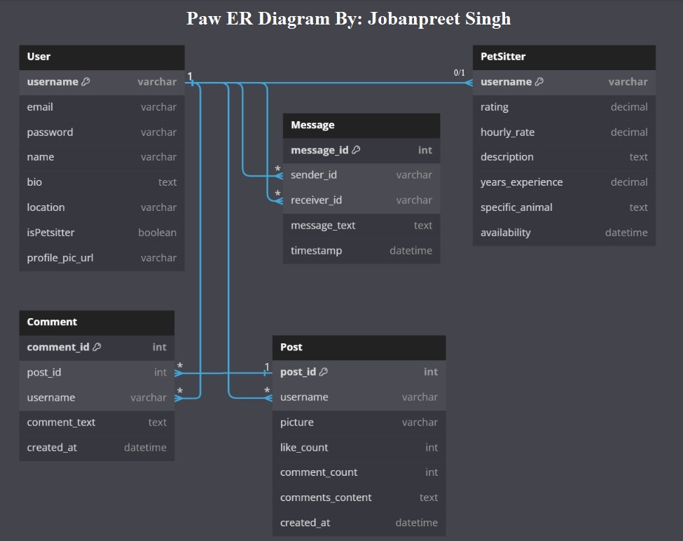

# PAW Architecture
## By: Jobanpreet Singh
Session 8 Assignment: This document describes the overall architecture of the PAW Application. 

## Highlevel Component Digram

In the high-level diagram above, you can observe the interactions among the major components of the application. The Web-Client serves as the frontend through which users interact with the system. The Web-Server (localhost) is the local server used for development of the application and it processes https and/or json requests from the web client. The App-Server (node.js) is a React framework that allows server-side rendering and generation of web pages. The App-Server communicates with the web server via https and protocol. The Database-Server (Firebase) is the backend that provides a real-time database. The App-Server communicates with Firebase over https using bson, a binary representation of json-like documents.

## Entity Relationship Diagram

pk = primary key, fk = foreign key

1. User entity store essential user information such as usernames(pk), email addresses, passwords, names, bios, locations, profile picture URLs, and whether they are pet sitters or not.

2. Post entity contain details about user-generated content, including post IDs (pk), username (fk), picture url, like counts, comment counts, and comments content.

3. Message entity hold data for direct communication between users, storing message IDs (pk), sender IDs (fk), receiver IDs (fk), message texts, and timestamps.

4. PetSitter entity stores information about users who offer pet sitting services, including username (pk and fk), ratings, hourly rates, descriptions, years of experience, specific animal preferences, and availability.

5. Comment entity stores comments made on posts, linking each comment to its parent post through post IDs (fk), associating them with the commenter's username (fk), comment texts, and creation timestamps.

Regarding the relationships depicted in the diagram:

A user can have multiple posts, messages, and comments associated with them, establishing one-to-many relationships between User, Post, Message, and Comment. Messages have a one-to-one relationship with both sender and receiver user, ensuring direct communication. Users may or may not be pet sitters, indicating a one-to-zero-or-one relationship between User and PetSitter. Finally, comments are associated with a single post, forming a many-to-one relationship between Comment and Post.

## Call Sequence Diagram

The sequence diagram above illustrates the process of creating a new post. Assuming the user is signed in to the application, they will navigate to the profile page where they will find the option to create a post. Upon clicking the "create a post" button, a request will be sent to open a window for browsing pictures. The user will then select a picture, and the application in return will display a button to submit the post. Subsequently, the user clicks the "submit post" button, triggering a request to the app-server, which in turn initiates a createPost() request to Firebase (database). If the post is successfully posted to the database, a promise is returned, prompting the app-server to send another request to fetchPost(). Upon successful completion of this request, a promise containing JSON data of all the user's posts is returned to the app-server. Finally, the app-server renders the JSON data to the user on the profile page.
