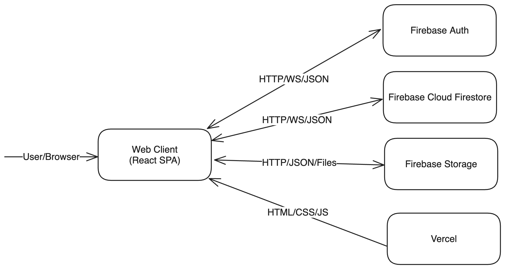
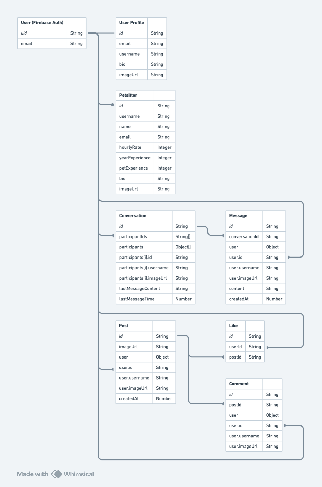

# Paw Architecture

## 1. Component Diagram

Paw is a React single-page application (SPA) with a Firebase backend. As a SPA, the application consists primarily of static HTML, CSS, and JavaScript assets, which are hosted by Vercel. The application integrates the Firebase JS SDK, which uses a combination of HTTP and websocket connections to communicate with the Firebase backend. A variety of Firebase services are used, including Firebase Auth for user authentication, Firebase Cloud Firestore for data storage, and Firebase Storage for file storage.

## 2. Entity Relationship Diagram

The database structure is centered around the user, whose ID and email are provided by Firebase Auth. The database includes the following collections:

- **Users:** User profile, contains information that is not stored by Firebase Auth
- **Petsitters:** Petsitter profile, belongs to one user
- **Posts:** Posts for pets, has many likes and comments
- **Likes:** Likes for posts, belongs to a post and a user
- **Comments:** Comments for posts, belongs to a post and a user
- **Conversations:** Conversations between two or more users; has many messages
- **Messages:** Messages sent in conversations, belongs to a conversation and a user

Paw is designed to follow best practices for the NoSQL environment provided by Cloud Firestore. As a result, several collections — including posts, comments, conversations, and messages — contain a copy of the user’s ID, username, and image URL. This enables us to display the relevant information without performing additional queries.

