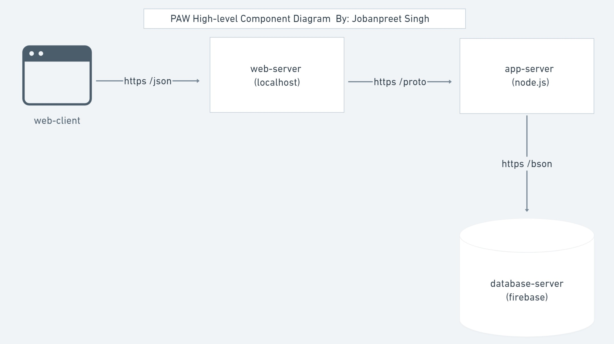

# PAW Architecture
## By: Jobanpreet Singh
Session 8 Assignment: This document describes the overall architecture of the PAW Application. 

## Highlevel Component Digram

In the high-level diagram above, you can observe the interactions among the major components of the application. The Web-Client serves as the frontend through which users interact with the system. The Web-Server (localhost) is the local server used for development of the application and it processes https and/or json requests from the web client. The App-Server (node.js) is a React framework that allows server-side rendering and generation of web pages. The App-Server communicates with the web server via https and protocol. The Database-Server (Firebase) is the backend that provides a real-time database. The App-Server communicates with Firebase over https using bson, a binary representation of json-like documents.

## Entity Relationship Diagram

The ER diagram depicts the database schema and the relationships among the entities: Users, Posts, Messages, PetSitters, and Comments. The Users entity stores essential user information, while the Post entity contains details about user-generated content. The Message entity holds data for direct communication between users, and the PetSitter entity stores information about users who offer pet sitting services. Lastly, the Comments entity stores comments made on posts.

Regarding the relationships depicted in the diagram:
 
Users can have multiple posts, messages, and comments associated with them, establishing one-to-many relationships between Users and Posts, Messages, and Comments. Messages have a one-to-one relationship with both sender and receiver Users, ensuring direct communication. Users may or may not be pet sitters, indicating a one-to-zero-or-one relationship between Users and PetSitters. Finally, Comments are associated with a single post, forming a many-to-one relationship between Comments and Posts.

## Call Sequence Diagram

The sequence diagram above describes the process of creating a new post. The user (assuming is signed in the application) will be on the profile page where they will have the option to create a post. User will click the button "create a post" and this will send a request to the app-server to open a window to browse for the picture. Then the user will select the picture and it will return to a button that allows them to submit the post. Next, user clicks the submit post button and the request is sent to the app-server which triggers a createPost() request to the firebase (database). If the post is successfully posted to the database a promise is returned and the app-server send another request to fetchPost(). If the request is successfull, a promise is returned to the app-server with json data of all the users posts. Lastly, the app-server renders the json data to the user in the profile page.
