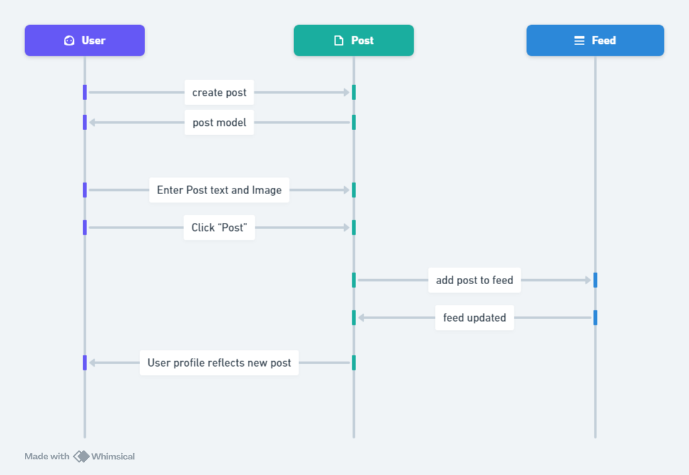

## High level component diagram

When the web client is initiated the Vite built in web server serves either the feed or a log in interface dependent on whether the user is logged in. If the user is logged in then their data--profile photo and posts as well as any other relevant information--is fetched from the Database. Otherwise, if the user is not logged they will be prompted to and once done they will be authenticated withe Firebase auth, and the relevant data about the user is fetched from the database.

## ER diagram

The Posts collection represents each individual post that will be displayed to the the feed. Where each post is related by it's owner through their id of user email--this is always unique. The Users collection will contain the information that would be displayed on their profile and provides important data used in other collection like the email which is used as the id in posts.

## Call sequence diagram

For the call sequence diagram it is showing the post creation sequence, thus it starts with a user creating a post--the way that this will be initiated has not been developed yet--and then a post model is provided to the user from the post which will contain a text area for adding text to the post and image upload field for images in the post as well. Once the user is done entering the details of the post they then click the post button which then populates the firestore Posts collection to include the new post. The feed is then updated on refresh and the user's profile reflects that they have a new post. 